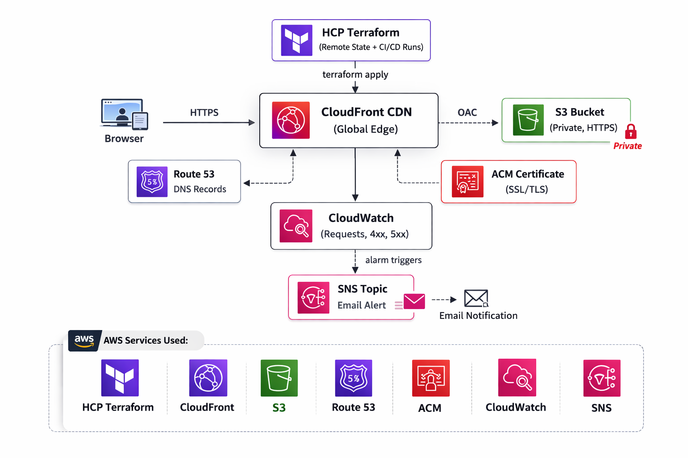

# ☁️ younesallaoui.com — AWS Static Portfolio Infrastructure

> **Production-grade AWS infrastructure** for a personal portfolio website, fully automated with Terraform and managed via HCP Terraform (Terraform Cloud). Built with security, performance, and observability best practices.

---
## 📋 Table of Contents

- [Architecture Overview](#️-architecture-overview)
- [Project Structure](#-project-structure)
- [Infrastructure Components](#-infrastructure-components)
  - [main.tf — Terraform Core Configuration](#maintf--terraform-core-configuration)
  - [s3.tf — Static Website Storage](#s3tf--static-website-storage)
  - [acm.tf — SSL/TLS Certificate](#acmtf--ssltls-certificate)
  - [cloudfront.tf — Global CDN Distribution](#cloudfronttf--global-cdn-distribution)
  - [route53.tf — DNS Management](#route53tf--dns-management)
  - [cloudwatch.tf — Monitoring & Alerting](#cloudwatchtf--monitoring--alerting)
  - [sns.tf — Email Notifications](#snstf--email-notifications)
  - [variables.tf — Input Variables](#variablestf--input-variables)
  - [outputs.tf — Output Values](#outputstf--output-values)
- [Estimated Monthly Cost](#-estimated-monthly-cost)
- [Security Highlights](#-security-highlights)
- [Tech Stack](#️-tech-stack)
---

## 🏗️ Architecture Overview



## 📁 Project Structure

```
terraform-portfolio/
│
├── tf.files/
│   ├── main.tf           # Terraform core config + AWS providers
│   ├── provider.tf       # Provider declarations
│   ├── variables.tf      # Input variables (region, domain, email)
│   ├── outputs.tf        # Output values exposed after apply
│   │
│   ├── s3.tf             # S3 bucket (private, versioned, OAC-protected)
│   ├── acm.tf            # SSL/TLS certificate + automatic DNS validation
│   ├── cloudfront.tf     # CDN distribution + Origin Access Control
│   ├── route53.tf        # DNS hosted zone + A records (apex + www)
│   ├── cloudwatch.tf     # Monitoring alarms (Requests, 4xx, 5xx)
│   ├── sns.tf            # Email alert notifications
│   │
│   ├── index.html        # Portfolio website (static)
│   └── error.html        # Custom 404 error page
│
└── README.md
```

---

##  Infrastructure Components

### `main.tf` — Terraform Core Configuration
Defines the **Terraform version constraint** (`>= 1.3.0`) and the **AWS provider** (`~> 5.0`). Declares two provider instances:
- `aws` → primary region `eu-west-3` (Paris) for all main resources
- `aws.us_east_1` → mandatory alias for ACM certificates, which must be provisioned in `us-east-1` to work with CloudFront (AWS requirement)

---

### `s3.tf` — Static Website Storage
Provisions a **private S3 bucket** named after the domain (`younesallaoui.com`) to host the static HTML files.

Key security decisions:
- **All public access blocked** — the bucket is never directly accessible from the internet
- **Versioning enabled** — allows rollback to any previous version of the website
- **Bucket policy** restricts access exclusively to the CloudFront distribution via **Origin Access Control (OAC)**, the modern replacement for the legacy Origin Access Identity (OAI)
- **Automatic upload** of `index.html` on every `terraform apply`, with `etag`-based change detection to avoid unnecessary re-uploads

---

### `acm.tf` — SSL/TLS Certificate
Provisions a **free SSL/TLS certificate** via AWS Certificate Manager (ACM) covering both `younesallaoui.com` and `www.younesallaoui.com`.

Key technical points:
- Certificate is provisioned in `us-east-1` (mandatory for CloudFront)
- **DNS validation** is used (more reliable than email validation) — Terraform automatically creates the required CNAME records in Route 53
- `lifecycle { create_before_destroy = true }` ensures zero-downtime certificate renewal
- `terraform apply` waits for full certificate validation before proceeding

---

### `cloudfront.tf` — Global CDN Distribution
Deploys a **CloudFront distribution** that serves the portfolio globally from AWS edge locations across Europe and North America (`PriceClass_100`).

Key configuration:
- **HTTPS enforced** — all HTTP requests are automatically redirected to HTTPS
- **TLS 1.2 minimum** — modern security standard (`TLSv1.2_2021`)
- **IPv6 enabled** — future-proof connectivity
- **Compression enabled** — automatic Gzip/Brotli compression for faster load times
- **Aggressive caching** — `default_ttl = 86400` (1 day), `max_ttl = 31536000` (1 year)
- **Custom error pages** — both 403 and 404 errors are handled gracefully and redirected to `error.html`
- **OAC (Origin Access Control)** — uses SigV4 signing to authenticate requests to S3, replacing the legacy OAI method

---

### `route53.tf` — DNS Management
Manages **DNS routing** for the domain. Since the domain `younesallaoui.com` is purchased directly through AWS Route 53, the hosted zone is automatically pre-created — Terraform uses a **data source** to reference the existing zone rather than creating a new one.

Creates two **Alias A records** pointing to the CloudFront distribution:
- `younesallaoui.com` (apex domain)
- `www.younesallaoui.com`

Using Route 53 Alias records (instead of standard CNAME) is best practice for apex domains and provides native AWS health checking.

---

### `cloudwatch.tf` — Monitoring & Alerting
Sets up **3 CloudWatch metric alarms** monitoring the CloudFront distribution in real time:

| Alarm | Metric | Threshold | Purpose |
|-------|--------|-----------|---------|
| `cloudfront-requests` | `Requests` | > 10,000 / 5 min | Detect abnormal traffic spikes |
| `cloudfront-5xx-error-rate` | `5xxErrorRate` | > 1% | Detect server-side errors |
| `cloudfront-4xx-error-rate` | `4xxErrorRate` | > 5% | Detect broken links or missing pages |

All alarms use `treat_missing_data = "notBreaching"` to avoid false positives during low-traffic periods.

---

### `sns.tf` — Email Notifications
Creates an **SNS Topic** (`cloudfront-alerts`) and an **email subscription** tied to the `alert_email` variable. When a CloudWatch alarm triggers, an email notification is sent automatically.

The `alert_email` variable is stored as a **sensitive variable in HCP Terraform** — it is never committed to the Git repository.

>  After the first `terraform apply`, AWS sends a confirmation email. You must click **"Confirm subscription"** to activate alerts.

---

### `variables.tf` — Input Variables

| Variable | Default | Description |
|----------|---------|-------------|
| `aws_region` | `eu-west-3` | Primary AWS region (Paris) |
| `domain_name` | `younesallaoui.com` | Root domain name |
| `alert_email` | *(none)* | Email for CloudWatch alerts — set in HCP Terraform as sensitive |

---

### `outputs.tf` — Output Values
Exposes key infrastructure values after `terraform apply`:

| Output | Description |
|--------|-------------|
| `website_url` | Final website URL (`https://younesallaoui.com`) |
| `cloudfront_url` | Raw CloudFront distribution URL |
| `s3_bucket_name` | Name of the S3 bucket |
| `certificate_arn` | ARN of the ACM SSL certificate |
| `route53_nameservers` | Route 53 nameservers for the hosted zone |

---

## FinOps Considerations - Estimated Monthly Cost

| Service | Cost |
|---------|------|
| S3 (storage + requests) | ~$0.01 |
| CloudFront (1M requests) | ~$0.50 |
| Route 53 (hosted zone) | ~$0.50 |
| CloudWatch (3 alarms) | ~$0.30 |
| ACM Certificate | Free ✅ |
| SNS (email alerts) | Free ✅ |
| **Total** | **~$1.30 / month** |


---

## 🔒 Security Highlights

- S3 bucket is **fully private** — no direct public access, ever
- CloudFront uses **OAC with SigV4** signing (latest AWS security standard)
- SSL/TLS certificate enforces **minimum TLS 1.2**
- Sensitive variables (`alert_email`) are stored in **HCP Terraform** — never in the codebase
- S3 bucket versioning protects against accidental file deletion

---

## 🛠️ Tech Stack


